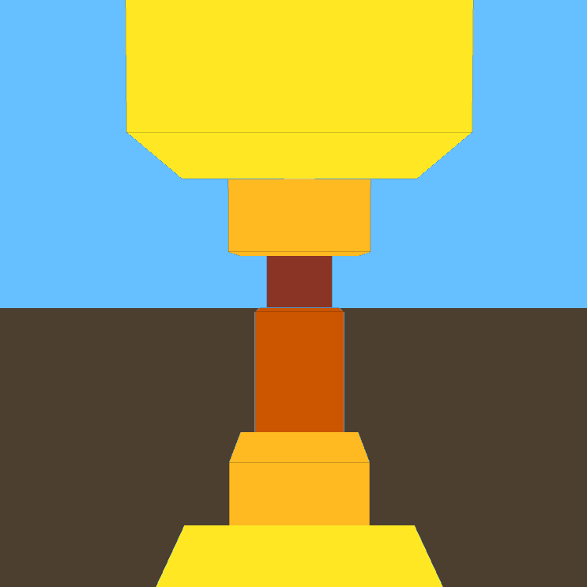

# simple-raylib-game-dodge-blocks

dodge_blocks is a simple gravity bounded,3-D, first person obstacle avoiding game made in C with the help of  [raylib](https://www.raylib.com/) library.

>For the installation of raylib and running the `main.c` file on respective platform is described in this `raylib` [wiki](https://github.com/raysan5/raylib/wiki).

